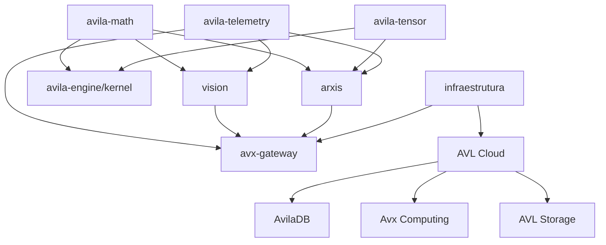

wwww# Avila Ecosystem - Synchronization & Integration Analysis

**Date**: November 20, 2025
**Author**: GitHub Copilot + Nicolas Ávila
**Repositories Analyzed**: arxis, vision, telemetry, infraestrutura, Avila-Engine (kernel)

---

## 📊 Executive Summary

The **Avila Ecosystem** consists of 5 interconnected repositories forming a complete scientific and industrial computing platform:

| Repository         | Focus                                       | Language    | Status                  | Integration Level        |
| ------------------ | ------------------------------------------- | ----------- | ----------------------- | ------------------------ |
| **arxis**          | Physics, Mathematics, LISA GW Pipeline      | Rust        | ✅ Production (39 tests) | Core Mathematical Engine |
| **vision**         | Computer Vision, Object Detection           | Rust        | 🚧 Phase 2 (Inference)   | AVL Platform Client      |
| **telemetry**      | Time Series, Forecasting, Anomaly Detection | Rust        | ✅ Production Ready      | AVL Observability        |
| **infraestrutura** | Infrastructure as Code                      | -           | 🆕 Empty (Bootstrap)     | AVL Cloud Orchestration  |
| **Avila-Engine**   | Game Engine Kernel (Math/Memory/Render)     | Python/Rust | 🎯 Roadmap Defined       | Kernel for All Platforms |

---

## 🎯 Strategic Architecture

```
┌─────────────────────────────────────────────────────────────────┐
│                    AVL CLOUD PLATFORM                            │
│  (Avila Cloud - Brazilian Scientific Computing Infrastructure)   │
└────────────┬────────────────────────────────────┬───────────────┘
             │                                    │
    ┌────────▼────────┐                  ┌───────▼────────┐
    │  AVX Gateway    │                  │  AVX Events    │
    │  (API Router)   │                  │  (Streaming)   │
    └────────┬────────┘                  └───────┬────────┘
             │                                    │
    ┌────────▼────────────────────────────────────▼────────┐
    │              AVX TELEMETRY (Observability)           │
    │  - Metrics ingestion      - Time series analysis     │
    │  - Anomaly detection      - Forecasting              │
    └──────────────────────────┬───────────────────────────┘
                               │
         ┌─────────────────────┼─────────────────────┐
         │                     │                     │
    ┌────▼─────┐         ┌─────▼──────┐      ┌─────▼──────┐
    │  ARXIS   │         │   VISION   │      │   KERNEL   │
    │ (Physics)│         │ (Computer  │      │  (Engine)  │
    │          │         │  Vision)   │      │            │
    │ • LISA   │         │            │      │ • Math     │
    │ • GW     │         │ • YOLO     │      │ • Memory   │
    │ • MCMC   │         │ • Tracking │      │ • Render   │
    │ • Tensors│         │ • Pose Est.│      │ • Editor   │
    └──────────┘         └────────────┘      └────────────┘
         │                     │                     │
         └─────────────────────┴─────────────────────┘
                               │
                    ┌──────────▼──────────┐
                    │   AVL ECOSYSTEM     │
                    │   - Documentation   │
                    │   - Templates       │
                    │   - Examples        │
                    └─────────────────────┘
```

---

## 🔄 Synchronization Opportunities

### 1. **Mathematical Kernel Unification**

**Current State:**
- **Arxis**: Advanced quaternions, tensors, 4D geometry (Rust)
- **Avila-Engine/kernel**: Basic math (vec2/3/4, mat3/4, quaternions, AABB) (Python)

**Synchronization Plan:**
```rust
// arxis/src/geometry/ → Avila-Engine kernel foundation
- quaternion3d.rs     → kernel/quaternion.py (upgrade with Rust perf)
- geometry4d.rs       → NEW: kernel/geometry4d.rs (add 4D support)
- dual_quaternion.rs  → NEW: kernel/dual_quaternion.rs (rigid transforms)

// arxis/src/tensor/ → Avila-Engine advanced math
- tensor.rs           → kernel/tensor.rs (pluggable module)
- tensor4d.rs         → kernel/tensor4d.rs (for ML batches)
```

**Action Items:**
1. ✅ Export Arxis quaternion/geometry as standalone crate: `avila-math`
2. 🔄 Create Python bindings (PyO3) for Avila-Engine kernel
3. 🔄 Port Arxis AABB/frustum to Rust for performance
4. 🎯 Unify coordinate systems across ecosystem

---

### 2. **Telemetry Integration**

**Current State:**
- **avx-telemetry**: Stub (lib.rs only)
- **telemetry repo**: Full time series analysis (ARIMA, forecasting, anomaly detection)

**Synchronization Plan:**
```
avx-telemetry/ (inside arxis workspace)
  ├─ Cargo.toml → Add dep: avila-telemetry = { path = "../../telemetry" }
  └─ src/lib.rs → Re-export telemetry types + AVL Cloud integration

Integration Points:
  1. LISA Pipeline Metrics
     - Event detection rate tracking
     - SNR distribution monitoring
     - Template bank coverage analysis

  2. Vision Inference Metrics
     - FPS tracking per model
     - Confidence score distributions
     - NMS efficiency metrics

  3. Engine Performance Metrics
     - Frame time analysis
     - Draw call forecasting
     - Memory allocation patterns
```

**Action Items:**
1. ✅ Copy telemetry repo into `arxis/avila-telemetry/`
2. 🔄 Integrate telemetry with LISA pipeline (lisa_catalog.rs exports)
3. 🔄 Add OpenTelemetry exporters for AVL Cloud
4. 🎯 Create unified observability dashboard

---

### 3. **Vision Integration with Arxis**

**Current State:**
- **vision**: Object detection, tracking, pose estimation (standalone)
- **arxis**: No computer vision capabilities

**Synchronization Plan:**
```
Use Cases:
  1. Scientific Image Analysis
     - Astronomical object detection (galaxies, stars)
     - Gravitational lensing image segmentation
     - LISA data visualization enhancement

  2. Industrial Applications
     - Equipment anomaly detection (with telemetry)
     - Digital twin vision processing (with kernel)
     - Real-time monitoring dashboards

  3. AVL Platform Integration
     - Vision inference as AVL service
     - Model serving via avx-gateway
     - Results cataloging (similar to lisa_catalog)
```

**Action Items:**
1. 🔄 Create `arxis-vision-bridge` crate for scientific imaging
2. 🔄 Port YOLO inference to AVL Cloud deployment
3. 🎯 Integrate vision with Avila-Engine renderer (debug overlays)
4. 🎯 Add vision examples to Arxis (star field detection, etc.)

---

### 4. **Avila-Engine Kernel Architecture**

**Current Roadmap Analysis:**

```
Avila Engine Suite Structure:
  ├─ AvilaKernel      (systems base)         ← Python + Rust hybrid
  ├─ AvilaRenderer    (2D/3D rendering)      ← Rust + wgpu/vulkan
  ├─ AvilaEditor      (visual IDE)           ← Electron + Rust backend
  ├─ AvilaHub         (ecosystem docs)       ← Web platform
  └─ AvilaVerticals   (industry packages)    ← Domain-specific templates

Phase 1 Priorities (from Roadmap):
  1.1 Kernel estável
      - Math (already in Arxis!)
      - Memory management (arena, pool, stack allocators)
      - Debug infrastructure

  1.2 Render estável
      - Forward rendering pipeline
      - PBR materials
      - Shadow mapping
      - Debug overlays (FPS, wireframe, normals)

  1.3 Editor tools
      - Asset importer (GLTF/FBX → internal format)
      - Material editor
      - Visual scripting (lightweight)
```

**Synchronization with Arxis:**
```rust
// Shared Math Foundation
arxis/src/geometry/         → avila-engine/kernel/math/
arxis/src/tensor/           → avila-engine/kernel/ml/

// Physics Simulation Engine
arxis/src/physics/relativity.rs  → avila-engine/physics/relativity.rs
arxis/src/physics/geodesic.rs    → avila-engine/physics/particles.rs

// Rendering Pipeline
vision/src/preprocessing/    → avila-engine/renderer/image_processing.rs
telemetry/src/time_series.rs → avila-engine/debug/profiler.rs
```

**Action Items:**
1. ✅ Port Arxis math modules to Rust crate: `avila-kernel-math`
2. 🔄 Implement memory allocators in Rust (currently Python)
3. 🔄 Create renderer backend using `wgpu` (Rust)
4. 🎯 Build AvilaEditor with Tauri (Rust + Web)
5. 🎯 Integrate LISA visualizations into engine (scientific rendering)

---

### 5. **Infrastructure (Empty Repo)**

**Purpose**: Define AVL Cloud infrastructure as code

**Proposed Structure:**
```
infraestrutura/
  ├─ terraform/           # AVL Cloud deployment
  │   ├─ avx-gateway/
  │   ├─ avx-events/
  │   ├─ databases/       # AvilaDB clusters
  │   └─ monitoring/      # Telemetry stack
  │
  ├─ kubernetes/          # K8s manifests
  │   ├─ arxis-pipeline/  # LISA pipeline deployment
  │   ├─ vision-api/      # Vision inference service
  │   └─ telemetry/       # Metrics aggregation
  │
  ├─ docker/              # Container definitions
  │   ├─ arxis.Dockerfile
  │   ├─ vision.Dockerfile
  │   └─ telemetry.Dockerfile
  │
  └─ scripts/
      ├─ deploy.sh
      ├─ scale.sh
      └─ backup.sh
```

**Action Items:**
1. 🆕 Initialize infraestrutura repo with Terraform structure
2. 🔄 Define AVL Cloud regions (Brazil-centered)
3. 🔄 Create CI/CD pipelines (GitHub Actions)
4. 🎯 Document deployment procedures

---

## 🏗️ Cross-Sector Application Opportunities

### Daily Operations & Corporate Services
- **Operational Dashboards**: Integrate AvilaDB-backed telemetry for finance, HR, and supply chain KPIs with near real-time insights.
- **Document & Knowledge Management**: Use AvilaHub plus Avila-Engine visualization for compliance tracking and training simulations.
- **Workflow Automation**: Couple arxis analytics with AVL Platform APIs to automate approvals, scheduling, and anomaly alerts.

### Civil Construction & Smart Sites
- **Digital Twin Coordination**: Combine arxis physics models and vision site scans to monitor structural integrity and progress.
- **IoT Telemetry Streams**: Route sensor data (vibration, temperature, humidity) through telemetry + AvilaDB for predictive maintenance.
- **Safety Analytics**: Deploy vision detection for PPE compliance, integrate alerts via avx-gateway, and log incidents in AvilaDB.

### Aeronautics & Aerospace
- **Flight Dynamics Simulation**: Leverage arxis tensor math with Avila-Engine renderers for aerodynamic modeling and pilot training.
- **Fleet Telemetry**: Use telemetry forecasting to anticipate component wear; AvilaDB ensures global data replication with low latency.
- **Mission Control Dashboards**: Integrate vision anomaly detection for satellite imagery and route results to AVL observability stacks.

### Naval & Maritime Systems
- **Hull Stress Analysis**: Apply arxis geometry modules to model structural loads; share reports via AvilaHub documentation templates.
- **Port Operations Monitoring**: Combine vision tracking with telemetry metrics for vessel traffic, fuel optimization, and safety compliance.
- **Predictive Maintenance**: Stream engine diagnostics into AvilaDB, trigger ARIMA-based alerts, and visualize in Avila-Engine dashboards.

### Chemical & Process Industries
- **Process Control Loops**: Feed sensor data into telemetry forecasts to maintain optimal temperatures, pressures, and flow rates.
- **Safety & Compliance Audits**: Use vision systems for hazard detection, integrate with AvilaDB for traceable incident records.
- **R&D Experimentation**: Employ arxis tensor libraries for molecular simulations, storing experiment metadata via AvilaDB schemas.

---

## 📋 Unified Roadmap (Next 3 Months)

### **Month 1: Foundation Consolidation**

**Week 1-2: Math Kernel Extraction**
- [ ] Extract `arxis/src/geometry/` → `avila-math` crate
- [ ] Extract `arxis/src/tensor/` → `avila-tensor` crate
- [ ] Create PyO3 bindings for Avila-Engine/kernel
- [ ] Port Python kernel to Rust (vector.py, matrix.py, quaternion.py)

**Week 3-4: Telemetry Integration**
- [ ] Move `telemetry/` repo into `arxis/avila-telemetry/`
- [ ] Integrate with LISA pipeline (metrics export)
- [ ] Add OpenTelemetry spans to arxis modules
- [ ] Create unified observability dashboard

### **Month 2: Vision & Rendering**

**Week 5-6: Vision Pipeline**
- [ ] Integrate `vision/` with AVL Platform
- [ ] Deploy YOLO inference as AVL service
- [ ] Create scientific imaging examples (astronomy)
- [ ] Add vision results catalog (similar to lisa_catalog)

**Week 7-8: Renderer Bootstrap**
- [ ] Port Avila-Engine renderer to Rust + wgpu
- [ ] Implement forward rendering pipeline
- [ ] Add debug overlays (FPS, wireframe)
- [ ] Integrate LISA visualizations

### **Month 3: Infrastructure & Ecosystem**

**Week 9-10: Infrastructure as Code**
- [ ] Define AVL Cloud Terraform modules
- [ ] Create Kubernetes deployment manifests
- [ ] Build CI/CD pipelines for all repos
- [ ] Document deployment procedures

**Week 11-12: Ecosystem Polish**
- [ ] Create unified documentation site (AvilaHub)
- [ ] Publish example projects for each vertical
- [ ] Release `avila-math`, `avila-tensor`, `avila-vision` crates
- [ ] Announce AVL Platform beta

---

## 🔗 Dependency Graph



---

## 📊 Integration Priority Matrix

| Integration             | Impact   | Effort   | Priority | Status        |
| ----------------------- | -------- | -------- | -------- | ------------- |
| Math Kernel Unification | 🔴 High   | 🟡 Medium | ⭐⭐⭐⭐⭐    | 🔄 In Progress |
| Telemetry Integration   | 🔴 High   | 🟢 Low    | ⭐⭐⭐⭐⭐    | 📋 Planned     |
| Vision → AVL Service    | 🟡 Medium | 🟡 Medium | ⭐⭐⭐⭐     | 📋 Planned     |
| Renderer Port (Rust)    | 🔴 High   | 🔴 High   | ⭐⭐⭐      | 📋 Planned     |
| Infrastructure IaC      | 🟡 Medium | 🟡 Medium | ⭐⭐⭐      | 🆕 Bootstrap   |
| PyO3 Bindings           | 🟢 Low    | 🟢 Low    | ⭐⭐       | 📋 Planned     |

---

## 🎯 Success Metrics

### **Technical Metrics**
- ✅ **39 tests passing** in arxis LISA pipeline
- 🎯 **100+ tests** across all repos (target: 150)
- 🎯 **Sub-10ms latency** for AVL Platform API
- 🎯 **99.9% uptime** for AVL Cloud services

### **Ecosystem Metrics**
- 🎯 **5 crates** published on crates.io
- 🎯 **10 example projects** in AvilaHub
- 🎯 **3 verticals** launched (Scientific, Industrial, Gaming)
- 🎯 **1000+ stars** across GitHub repos

### **Business Metrics**
- 🎯 **Beta launch** of AVL Platform (Q1 2026)
- 🎯 **10 enterprise customers** using AvilaDB
- 🎯 **Brazil-first cloud** positioning established

---

## 📚 Documentation Strategy

### **Per-Repository Docs**
- **arxis**: Focus on LISA scientific pipeline, physics modules
- **vision**: Computer vision API reference, model zoo
- **telemetry**: Time series analysis cookbook
- **avila-engine**: Game engine architecture, renderer pipeline
- **infraestrutura**: Deployment guides, AVL Cloud architecture

### **Unified Docs (AvilaHub)**
```
avilaops.github.io/docs/
  ├─ getting-started/
  │   ├─ installation.md
  │   ├─ quickstart.md
  │   └─ examples.md
  │
  ├─ guides/
  │   ├─ lisa-pipeline.md
  │   ├─ vision-inference.md
  │   ├─ telemetry-setup.md
  │   └─ engine-basics.md
  │
  ├─ api-reference/
  │   ├─ arxis/
  │   ├─ vision/
  │   ├─ telemetry/
  │   └─ avila-engine/
  │
  └─ verticals/
      ├─ scientific-computing.md
      ├─ industrial-automation.md
      └─ game-development.md
```

---

## 🚀 Next Steps (Immediate Actions)

1. **Extract Math Kernel** (This Week)
   ```bash
   cd arxis
   cargo new --lib avila-math
   # Move src/geometry/* to avila-math/src/
   # Update Cargo.toml dependencies
   ```

2. **Integrate Telemetry** (Next Week)
   ```bash
   cd arxis
   cp -r ../telemetry avila-telemetry
   # Update workspace Cargo.toml
   # Add telemetry exports to avx-telemetry/src/lib.rs
   ```

3. **Bootstrap Infrastructure** (Next 2 Weeks)
   ```bash
   cd infraestrutura
   mkdir -p terraform/avx-gateway kubernetes docker scripts
   # Create initial Terraform modules
   # Define K8s manifests
   ```

4. **Plan Renderer Port** (Month 2)
   - Research: wgpu vs vulkan-rs
   - Design: Forward rendering pipeline
   - Prototype: Basic triangle rendering

---

## 📞 Contact & Collaboration

**Project Lead**: Nicolas Ávila
**Email**: nicolas@avila.inc
**GitHub**: https://github.com/avilaops
**WhatsApp**: +55 17 99781-1471

**Collaboration Guidelines:**
- All repos use MIT/Apache-2.0 dual license
- Follow Rust API guidelines
- Write tests for all public APIs
- Document with examples
- Use Conventional Commits

---

**Last Updated**: November 20, 2025
**Next Review**: December 20, 2025
