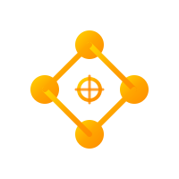

# 🌌 Arxis - Identidade Visual e Narrativa

**Data**: 20 de Novembro de 2025
**Versão**: 1.0

---

## 🎯 Narrativa do Projeto

> **"ARX + AXIS = ARXIS"**
> *A fortaleza que gira - sólida como rocha, dinâmica como o universo.*

---

### Elevator Pitch (30 segundos)
**"Arxis é a cidadela matemática do Rust - a fortaleza sólida e o eixo motor que impulsiona computação científica. Da álgebra de quaternions às ondas gravitacionais da NASA/LISA, somos o fundamento inabalável que revela os segredos do cosmos."**

### História de Origem

**O Nome**: "Arxis" tem raízes profundas na história e na física:

**ARX** (Latim) - "Fortaleza, Cidadela"
- O ponto mais alto e protegido de uma cidade antiga
- A fundação inabalável sobre a qual tudo se constrói
- Símbolo de solidez matemática e confiabilidade computacional

**AXIS** (Latim) - "Eixo, Centro"
- O eixo em torno do qual tudo gira
- O motor que impulsiona todos os sistemas
- O fundamento que sustenta projetos complexos

**Juntos formam "ARXIS"**: A fortaleza rotativa - forte e dinâmica ao mesmo tempo.

Em cada projeto que participa, **Arxis é o motor** - o núcleo matemático que fornece:
- 🏛️ **Fundações sólidas**: Matemática rigorosa (quaternions, tensores, geometria 4D)
- ⚙️ **O eixo central**: Engine computacional em torno do qual sistemas complexos giram
- 🛡️ **Proteção robusta**: Type-safety do Rust, testes rigorosos, APIs confiáveis
- 🚀 **Propulsão**: Performance nativa para simulações e cálculos de missão crítica

**Pronúncia**: "AR-sis" (como "arks" + "is")

**A Missão**:
Nascido da necessidade de processar dados da missão LISA (NASA/ESA), o Arxis evoluiu para um ecossistema completo de computação científica em Rust. Somos a cidadela matemática - a fortaleza inabalável e o eixo motor que conecta matemática pura (quaternions, tensores) com física aplicada (ondas gravitacionais, relatividade) através de APIs idiomáticas e performance nativa.### Manifesto

```
"Como as antigas cidadelas protegiam cidades,
Arxis protege a integridade de seus cálculos científicos.

Como o eixo sustenta a roda,
Arxis é o motor que impulsiona suas simulações.

Construída sobre fundações de aço (Rust):
- Quaternions rotacionam o espaço
- Tensores moldam dimensões
- Geometria 4D transcende nossa percepção

Desta fortaleza matemática, você detecta:
- Ondas gravitacionais de bilhões de anos-luz
- Fusões de buracos negros supermaciços
- A própria estrutura do espaço-tempo

Arxis não é apenas código.
É a ARX - a cidadela inabalável.
É o AXIS - o eixo central que move montanhas.
É a linguagem matemática do universo,
escrita em Rust,
para que você possa comandar o cosmos."
```

---

## 🎨 Paleta de Cores

### Tema: **Solar Energy** ☀️

Inspirado em:
- Energia do sol e estrelas
- Fusão nuclear e plasma estelar
- Ondas eletromagnéticas e radiação
- Calor, luz e transformação

### Cores Principais

#### 1. **Pure White** (Base)
```
HEX: #FFFFFF
RGB: (255, 255, 255)
HSL: (0°, 0%, 100%)
```
**Uso**: Background principal, cards, áreas de destaque
**Significado**: Clareza, precisão científica, pureza matemática

#### 2. **Solar Yellow** (Primária)
```
HEX: #FFD700
RGB: (255, 215, 0)
HSL: (50°, 100%, 50%)
```
**Uso**: Elementos principais, CTAs, highlights, badges
**Significado**: Energia solar, radiação estelar, descoberta
**Nota**: Cor vibrante e energética para elementos de ação

#### 3. **Stellar Orange** (Acento)
```
HEX: #FF8C00
RGB: (255, 140, 0)
HSL: (33°, 100%, 50%)
```
**Uso**: Acentos, hovers, links, elementos interativos
**Significado**: Fusão nuclear, plasma, transformação energética

#### 4. **Deep Space** (Contraste)
```
HEX: #1A1A1A
RGB: (26, 26, 26)
HSL: (0°, 0%, 10%)
```
**Uso**: Texto principal, títulos, elementos de contraste
**Significado**: Contraste forte, legibilidade, profundidade

#### 5. **Warm Amber** (Secundário)
```
HEX: #FFA500
RGB: (255, 165, 0)
HSL: (39°, 100%, 50%)
```
**Uso**: Badges, warnings, elementos importantes
**Significado**: Energia em transição, radiação térmica

### Cores de Suporte

#### Light Gray (Superfícies)
```
HEX: #F5F5F5
RGB: (245, 245, 245)
```
**Uso**: Backgrounds secundários, cards, separadores

#### Medium Gray (Bordas)
```
HEX: #E0E0E0
RGB: (224, 224, 224)
```
**Uso**: Bordas, divisores, sombras suaves

#### Text Gray (Texto secundário)
```
HEX: #666666
RGB: (102, 102, 102)
```
**Uso**: Texto secundário, legendas, descrições

#### Success Green
```
HEX: #4CAF50
RGB: (76, 175, 80)
```
**Uso**: ✅ Tests passing, status positivo

#### Error Red
```
HEX: #F44336
RGB: (244, 67, 54)
```
**Uso**: Erros, elementos críticos

---

## 🖼️ Conceitos de Logo

### Proposta 1: **Quaternion Spiral** ⭐ (RECOMENDADO)

**Conceito**:
Representação visual de um quaternion (4D) projetado em 2D, formando uma espiral que simboliza rotação e transformação.

**Elementos**:
- Espiral geométrica (Fibonacci/Golden ratio)
- 4 pontos cardeais (representando i, j, k, w)
- Gradiente Cyan → Purple (onda gravitacional)
- Linhas precisas e matemáticas

**Esboço ASCII**:
```
        ╱╲
       ╱  ╲
      ◉────◉
      │ ╱╲ │
      │╱  ╲│
      ◉────◉
       ╲  ╱
        ╲╱
```

**Variações**:
- **Full color**: Gradiente Yellow→Orange (#FFD700 → #FF8C00)
- **Monochrome**: Deep Space (#1A1A1A)
- **Icon**: Versão simplificada 32×32px
- **Light mode**: Texto escuro sobre fundo branco
- **Dark mode**: Yellow/Orange sobre fundo escuro

**Arquivo**: `arxis-logo-quaternion.svg`

---

### Proposta 2: **Gravitational Waves**

**Conceito**:
Ondas gravitacionais representadas como perturbações no espaço-tempo, com grid deformado.

**Elementos**:
- Grid 3D perspectivado
- Ondas senoidais atravessando
- Ponto focal (fonte gravitacional)
- Cores: Deep Blue + Cyan waves

**Esboço ASCII**:
```
╱ ╲ ╱ ╲ ╱ ╲ ╱ ╲
─────────────────
╲ ╱ ⚬ ╲ ╱ ╲ ╱ ╲  ← Onda gravitacional
─────────────────
╱ ╲ ╱ ╲ ╱ ╲ ╱ ╲
```

**Variações**:
- Animada: Ondas se propagando
- Estática: Snapshot de onda

**Arquivo**: `arxis-logo-waves.svg`

---

### Proposta 3: **4D Tesseract Projection**

**Conceito**:
Projeção 3D→2D de um tesseract (hipercubo 4D), simbolizando a capacidade do Arxis de trabalhar com geometria 4D.

**Elementos**:
- Cubo interno e externo conectados
- Linhas de projeção
- Perspectiva isométrica
- Gradiente de profundidade

**Esboço ASCII**:
```
      ┌─────┐
     ╱│    ╱│
    ┌─────┐ │
    │ │   │ │
    │ └───│─┘
    │╱    │╱
    └─────┘
```

**Variações**:
- Rotação animada
- Wireframe vs. solid

**Arquivo**: `arxis-logo-tesseract.svg`

---

### Proposta 4: **LISA Constellation** (Específico para NASA/LISA)

**Conceito**:
Constelação triangular da LISA (3 satélites) com ondas gravitacionais detectadas.

**Elementos**:
- 3 pontos formando triângulo equilátero
- Braços laser entre satélites
- Onda gravitacional passando pelo centro
- Escala: 2.5 milhões de km de lado

**Esboço ASCII**:
```
       ◉
      ╱ ╲
     ╱ ⚬ ╲  ← Onda GW
    ╱     ╲
   ◉───────◉
```

**Uso**: Badge específico para LISA, não logo principal

**Arquivo**: `arxis-badge-lisa.svg`

---

## 🎯 Recomendação Principal

### Logo Escolhido: **Quaternion Spiral** ⭐

**Justificativa**:
1. ✅ **Representa matematicamente** o núcleo do projeto (quaternions)
2. ✅ **Visualmente distinto** de outros projetos Rust/científicos
3. ✅ **Escalável** (funciona em 512×512 e 16×16)
4. ✅ **Moderno e científico** sem ser genérico
5. ✅ **Conecta** com espiral de Fibonacci (natureza + matemática)

**Implementação**:

#### Logotipo Horizontal
```
   ╱╲
  ╱  ╲
 ◉────◉   ARXIS
 │ ╱╲ │   Research-Grade Physics & Math in Rust
 │╱  ╲│
 ◉────◉
  ╲  ╱
   ╲╱
```

#### Logotipo Vertical (para ícones)
```
   ╱╲
  ╱  ╲
 ◉────◉
 │ ╱╲ │
 │╱  ╲│
 ◉────◉
  ╲  ╱
   ╲╱

 ARXIS
```

#### Favicon (16×16)
```
Versão ultra-simplificada:
   ◉
  ╱╲
 ◉──◉
  ╲╱
   ◉
```

---

## 🎨 Aplicações da Identidade Visual

### 1. README.md Header

```markdown
<div align="center">
  

  # 🚀 Arxis

  **Research-Grade Physics & Mathematics in Rust**

  []
  []
  []

  From quaternion algebra to gravitational waves

</div>
```

### 2. Website Hero Section

```
┌──────────────────────────────────────────────────────┐
│                                                      │
│             [LOGO ANIMADO - Rotação]                 │
│                                                      │
│                    A R X I S                         │
│       Research-Grade Physics & Math in Rust          │
│                                                      │
│   [Get Started]  [Documentation]  [GitHub]          │
│                                                      │
│  ✨ NASA/LISA Ready   🔬 101 Tests   ⚡ Blazing Fast │
│                                                      │
└──────────────────────────────────────────────────────┘
```

**Cores**:
- Background: `#FFFFFF` (Pure White)
- Logo: Gradiente Yellow→Orange (#FFD700 → #FF8C00)
- Texto principal: `#1A1A1A` (Deep Space)
- Badges: Orange accent (#FF8C00)

### 3. Documentation Theme

**docs.rs Custom Theme**:
```css
:root {
  --main-background-color: #FFFFFF;
  --main-color: #1A1A1A;
  --link-color: #FF8C00;
  --code-background: #F5F5F5;
  --inline-code-color: #FFD700;
  --heading-color: #FF8C00;
  --border-color: #E0E0E0;
}
```

### 4. Badges Personalizados

#### NASA/LISA Badge
```
┌─────────────────────┐
│  🛰️  NASA/LISA      │
│      READY          │
│                     │
│  Phase 1-6 ✅       │
└─────────────────────┘
```
**Cores**: Orange text (#FF8C00) on White background

#### AVL Platform Badge
```
┌─────────────────────┐
│  ☁️  AVL PLATFORM   │
│                     │
│  Native Integration │
└─────────────────────┘
```
**Cores**: Yellow (#FFD700) on White background

#### Tests Badge
```
┌─────────────────────┐
│  ✅  101 TESTS      │
│     PASSING         │
└─────────────────────┘
```
**Cores**: Green (#4CAF50) on White background

### 5. Apresentações e Slides

**Template de Slide**:
```
┌──────────────────────────────────────────────┐
│  [LOGO]                          ARXIS       │
│                                              │
│                                              │
│         CONTEÚDO DO SLIDE                    │
│                                              │
│                                              │
│                                              │
│  nicolas@avila.inc        avilaops/arxis     │
└──────────────────────────────────────────────┘
```

**Esquema de cores**:
- Background: Pure White (#FFFFFF)
- Títulos: Stellar Orange (#FF8C00)
- Texto: Deep Space (#1A1A1A)
- Código: Yellow highlights (#FFD700)
- Acentos: Solar Yellow (#FFD700)

### 6. Stickers e Merchandise

#### Hexagonal Sticker (Estilo Rust)
```
     ┌─────┐
    ╱       ╲
   ╱  [LOGO] ╲
  │           │
  │   ARXIS   │
  │           │
   ╲         ╱
    ╲       ╱
     └─────┘
```

**Tamanho**: 3" × 3.5"
**Material**: Vinil resistente
**Cores**: Full color + metallic cyan

#### T-Shirt Design
```
Frente:
  - Logo grande (centro do peito)
  - "ARXIS" abaixo

Costas:
  - Equação de onda gravitacional
  - "Research-Grade Physics in Rust"
  - github.com/avilaops/arxis
```

---

## 📐 Especificações Técnicas

### Logo Files

#### Arquivos a Criar:
```
assets/
├── logo/
│   ├── arxis-logo.svg           # Logo vetorial principal
│   ├── arxis-logo-dark.svg      # Versão dark mode
│   ├── arxis-logo-light.svg     # Versão light mode
│   ├── arxis-icon.svg           # Ícone quadrado
│   ├── arxis-wordmark.svg       # Apenas texto
│   └── arxis-horizontal.svg     # Logo + texto horizontal
│
├── badges/
│   ├── nasa-lisa-badge.svg
│   ├── avl-platform-badge.svg
│   └── tests-passing-badge.svg
│
└── exports/
    ├── PNG/
    │   ├── arxis-logo-512.png
    │   ├── arxis-logo-256.png
    │   ├── arxis-logo-128.png
    │   ├── arxis-logo-64.png
    │   ├── arxis-logo-32.png
    │   └── arxis-favicon-16.png
    │
    └── favicon.ico              # Multi-resolution
```

### Tamanhos Padrão

| Uso                   | Tamanho      | Formato |
| --------------------- | ------------ | ------- |
| GitHub Social Preview | 1280×640     | PNG     |
| README Header         | 400×400      | SVG/PNG |
| Crates.io Logo        | 256×256      | PNG     |
| Docs.rs Icon          | 64×64        | PNG     |
| Favicon               | 16×16, 32×32 | ICO     |
| OG Image              | 1200×630     | PNG     |
| Twitter Card          | 1200×600     | PNG     |

### Espaçamento (Clear Space)

Manter espaço mínimo equivalente a **25% da altura do logo** ao redor do logotipo em todas as aplicações.

```
┌────────────────────────┐
│                        │
│    ┌──────────┐        │  ← 25% clear space
│    │          │        │
│    │   LOGO   │        │
│    │          │        │
│    └──────────┘        │
│                        │
└────────────────────────┘
```

---

## 🎬 Animações (Opcional)

### Logo Animado (SVG + CSS)

#### 1. **Quaternion Rotation**
- Duração: 3 segundos
- Loop: Infinito
- Efeito: Logo rotaciona suavemente em torno do eixo central
- Uso: Website hero, loading screens

#### 2. **Wave Propagation**
- Duração: 2 segundos
- Loop: Infinito
- Efeito: Onda gravitacional atravessa o logo
- Uso: Section headers, transitions

#### 3. **Gradient Shift**
- Duração: 5 segundos
- Loop: Infinito
- Efeito: Gradiente Cyan↔Purple oscila
- Uso: Background animations

---

## 🖋️ Tipografia

### Font Stack

#### Headings (Títulos)
```css
font-family: 'Inter', 'SF Pro Display', -apple-system, BlinkMacSystemFont, 'Segoe UI', sans-serif;
font-weight: 700;
letter-spacing: -0.02em;
```

**Alternativa Open Source**:
- **Montserrat** (Bold 700)
- **Raleway** (Bold 700)

#### Body (Texto Corrido)
```css
font-family: 'Inter', -apple-system, BlinkMacSystemFont, 'Segoe UI', Roboto, sans-serif;
font-weight: 400;
line-height: 1.6;
```

#### Code (Código)
```css
font-family: 'JetBrains Mono', 'Fira Code', 'Cascadia Code', 'Courier New', monospace;
font-weight: 400;
font-variant-ligatures: common-ligatures;
```

**Recomendação**: **JetBrains Mono** (gratuita, ligatures, ótima para matemática)

### Hierarquia de Tamanhos

| Elemento   | Tamanho | Peso |
| ---------- | ------- | ---- |
| Hero Title | 64px    | 700  |
| H1         | 48px    | 700  |
| H2         | 36px    | 600  |
| H3         | 28px    | 600  |
| H4         | 24px    | 600  |
| Body       | 16px    | 400  |
| Small      | 14px    | 400  |
| Caption    | 12px    | 400  |
| Code       | 14px    | 400  |

---

## 📱 Responsividade

### Breakpoints
```css
/* Mobile First */
--mobile: 320px;
--tablet: 768px;
--desktop: 1024px;
--wide: 1440px;
```

### Logo Scaling
- **Desktop** (>1024px): Logo full size (200×200)
- **Tablet** (768-1024px): Logo 150×150
- **Mobile** (<768px): Logo 100×100

---

## 🌐 Social Media

### GitHub
- **Avatar**: Arxis icon (512×512 PNG)
- **Cover**: Deep blue with logo + "Research-Grade Physics in Rust"
- **Description**: "Advanced Physics & Mathematics Library for Rust 🌌 | NASA/LISA Ready | Quaternions • Tensors • Gravitational Waves"

### Twitter/X
- **Profile Pic**: Arxis icon (400×400 PNG)
- **Header**: 1500×500 - Gradient background with logo + key features
- **Bio**: "🚀 Research-grade physics & math in Rust | 🛰️ NASA/LISA mission ready | 🔬 Quaternions → Gravitational Waves | Built by @avilaops"

### LinkedIn
- **Logo**: Professional version (monochrome option)
- **Cover**: 1584×396 - Professional look with equations overlay

### Discord/Slack
- **Server Icon**: Arxis icon (circular crop)
- **Emojis**: :arxis:, :quaternion:, :gravitational_wave:

---

## 🎓 Tom de Voz (Brand Voice)

### Princípios
1. **Fundação Sólida**: Como uma cidadela, oferece base matemática inabalável
2. **Motor Central**: Como um eixo, impulsiona projetos complexos com eficiência
3. **Científico mas Acessível**: Precisão técnica sem jargão desnecessário
4. **Inspirador**: Conecta matemática com maravilhas do universo
5. **Pragmático**: Foco em performance e usabilidade
6. **Comunitário**: Open source, colaborativo, educacional

### Exemplos

#### ✅ BOM:
> "Arxis é a cidadela matemática do seu projeto. Fundações sólidas, motor poderoso, resultados inabaláveis."

> "Como uma fortaleza protege a cidade, Arxis protege a integridade dos seus cálculos científicos."

> "Arxis detecta ondas gravitacionais de buracos negros a bilhões de anos-luz de distância. Com apenas algumas linhas de Rust."

> "Em cada projeto, Arxis é o eixo - o motor central que impulsiona simulações complexas."

#### ❌ EVITAR:
> "Nossa implementação utiliza otimizações de alto nível em estruturas tensoriais para maximizar throughput computacional."

> "Arxis é o melhor, mais rápido e mais completo framework que existe."

**Call-to-Actions**

**Documentação**:
- "Enter the Citadel" (não "Read the Docs")
- "Build on the Foundation" (não "Get Started")
- "Join the Fortress" (não "Contribute")

**README**:
- "The mathematical citadel. The computational engine. Built in Rust."
- "From the fortress of quaternions to the axis of gravitational waves."
- "Arxis: Where solid foundations meet powerful engines."

---

## 🎁 Extras

### Easter Eggs Matemáticos

1. **404 Page**: "Lost in 4D space? Let's project you back to reality."
2. **Loading**: "Calculating geodesics..."
3. **Error Page**: "Encountered a singularity. Please restart your spacetime."

### Equações Decorativas

Para headers e banners, usar equações bonitas:

1. **Ondas Gravitacionais** (Einstein):
   ```
   Rμν - (1/2)gμνR = (8πG/c⁴)Tμν
   ```

2. **Quaternion Rotation**:
   ```
   v' = q × v × q*
   ```

3. **LISA Sensitivity**:
   ```
   Sn(f) = [Sa(f) + Sx(f)] × [1 + (2mHz/f)⁴]
   ```

---

## 📋 Checklist de Implementação

### Fase 1: Essencial (Esta Semana)
- [ ] Criar logo SVG (Quaternion Spiral)
- [ ] Gerar exports PNG (512, 256, 128, 64, 32, 16)
- [ ] Criar favicon.ico multi-res
- [ ] Atualizar README.md com novo header
- [ ] Adicionar badges customizados
- [ ] Criar pasta `assets/` no repositório

### Fase 2: Website (Próximo Mês)
- [ ] GitHub Pages com tema customizado
- [ ] docs.rs theme override
- [ ] OG images para compartilhamento
- [ ] Twitter cards

### Fase 3: Community (Q1 2026)
- [ ] Discord server com branding
- [ ] Sticker design para conferências
- [ ] T-shirt mock-ups
- [ ] Presentation template

---

## 🎨 Ferramentas Recomendadas

### Design
- **Figma** (Free): Design e prototipagem
- **Inkscape** (Free): Editor SVG
- **GIMP** (Free): Edição de imagens raster

### Fontes
- **Google Fonts**: Inter, Montserrat (free)
- **JetBrains Mono**: Code font (free)
- **Font Squirrel**: Conversão e otimização

### Animação
- **SVGO**: Otimização de SVG
- **Lottie**: Animações JSON
- **CSS Animations**: Nativo no browser

---

## 📞 Contato

**Design Lead**: Nicolas Ávila
**Email**: nicolas@avila.inc
**GitHub**: @avilaops

---

## 📄 Licença

Esta identidade visual é propriedade do projeto **Arxis** e está licenciada sob:
- **Código**: MIT OR Apache-2.0
- **Assets Visuais**: CC BY-SA 4.0 (Creative Commons Attribution-ShareAlike)

Você pode usar, modificar e compartilhar os assets visuais, desde que:
1. Dê crédito apropriado ao projeto Arxis
2. Indique mudanças feitas
3. Distribua sob a mesma licença

---

**Última Atualização**: 20 de Novembro de 2025
**Versão**: 1.0
**Status**: 🎨 Proposta Completa - Aguardando Aprovação

